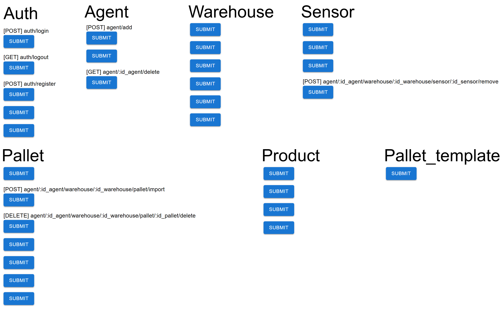

# Cold Storage Management API Tester

## Overview

This project provides a user-friendly interface for listing, testing, and verifying all APIs related to the Cold Storage Management system. Originally built to support a teammate during a university graduation thesis project (2021), this tool enables rapid API exploration and validation, streamlining the development and integration process for the larger [Cold Storage Management System](https://github.com/nhttoan0809/cold-storage-management-fe).

> **⚠️ Note:** This system is no longer operated as a standalone application and was developed solely as a supplementary tool for a larger system.

## Key Reflections & Lessons Learned

- **User Authentication & Session Management:**  
  Building this project provided valuable experience in implementing user account management and login authentication, following best practices for web applications. It also offered practical insights into managing user sessions securely and efficiently.

- **Technology Choices & Limitations:**  
  At the time, the project was implemented using custom solutions. In hindsight, adopting a tool like **Swagger** would have significantly accelerated development and improved usability for API documentation and testing.

- **Code Organization & Maintainability:**  
  The codebase lacks the use of modern extensions and best practices for clean architecture, maintainability, and scalability. This limitation is acknowledged as the project was created by a student long ago, primarily for learning purposes.

## Features

- 🔍 **API Listing:** View all available API endpoints in a structured format.
- ⚡ **Interactive Testing:** Run API requests directly from the UI and inspect responses in real time.
- 📝 **Result Verification:** Instantly check and debug API outputs for correctness.
- 🤝 **Collaboration:** Designed to assist backend and frontend developers in seamless API integration.

## Access & Routes

- **Home:** `/` — Dashboard and API overview.
- **API Details:** `/api/:endpoint` — Detailed view and test interface for each API.

## Tech Stack

- **Frontend:** React (bootstrapped with Create React App)
- **HTTP Client:** Axios
- **UI Components:** Material-UI
- **Routing:** React Router

## API Structure

- Each endpoint supports standard HTTP methods (GET, POST, PUT, DELETE)
- Structure:
  - Authentication: `/auth`
  - Agent: `/agent`
  - Warehouse: `/agent/:id_agent/warehouse`
  - Station: `/agent/:id_agent/warehouse/:id_warehouse/station`
  - Sensor: `/agent/:id_agent/warehouse/:id_warehouse/sensor`
  - Pallet: `/agent/:id_agent/warehouse/:id_warehouse/pallet`
  - Pallet Template: `/pallet_template`
  - Product: `agent/:id_agent/warehouse/:id_warehouse/prodcut`

## Motivation

This repository was created to accelerate API development and testing for the Cold Storage Management project, ensuring robust integration and reducing manual testing effort. It empowers developers to quickly validate endpoints and collaborate efficiently.

## Preference Image

---

_For more details on the main Cold Storage Management project, visit the [main repository](https://github.com/nhttoan0809/cold-storage-management-fe)_
